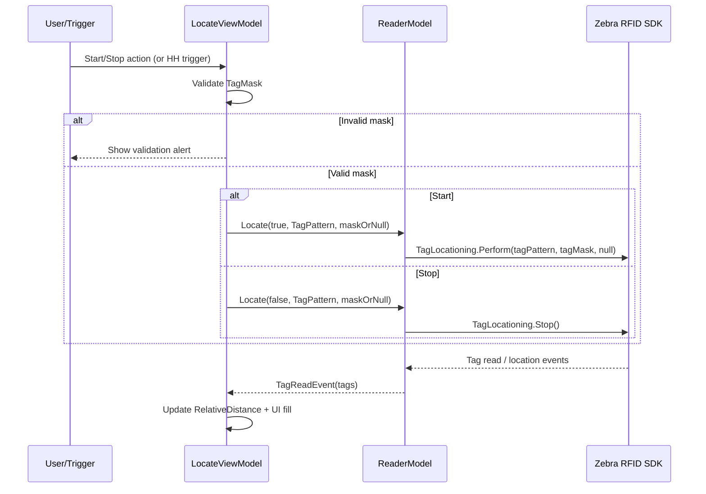

# Design: Tag Locating and Mask Handling

This document explains internal design decisions and data flow for tag locating.

For quick usage and operator-focused steps, see `readme.md`.

## Scope

The design covers:

- Locate start/stop control
- Optional tag mask validation and normalization
- SDK invocation path
- Event-driven distance updates

## Component Responsibilities

- LocateTag view
  - Collects `TagPattern` and optional `TagMask`.
  - Binds Start/Stop command and relative-distance visualization.

- LocateViewModel
  - Owns state: `TagPattern`, `TagMask`, `IsInventoryRunning`, `RelativeDistance`.
  - Validates `TagMask` format.
  - Converts empty mask to `null`.
  - Calls `ReaderModel.Locate(...)`.
  - Reacts to trigger events and tag read events.

- ReaderModel
  - Wraps Zebra SDK APIs.
  - Executes locate start/stop using `TagLocationing` actions.
  - Handles SDK exceptions and user alerts.

## Sequence Diagram



## Core Contracts

### Locate API Contract

```csharp
internal void Locate(bool start, string tagPattern, string tagMask)
```

- `start = true`: begin locate operation.
- `start = false`: stop locate operation.
- `tagPattern`: expected EPC/tag identifier input.
- `tagMask`: optional mask, may be `null`.

### Mask Validation Contract

Current app-level validation in `LocateViewModel` enforces:

- Allowed charset: hex only
- Length: even number of chars
- Storage normalization: uppercase

```csharp
if (!Regex.IsMatch(tagMask, "^[0-9a-fA-F]+$") || (tagMask.Length % 2 != 0))
{
    rfidModel.ShowAlert("Tag Mask must be hex (0-9, A-F) and contain an even number of characters.");
    return false;
}

tagMask = tagMask.ToUpperInvariant();
TagMask = tagMask;
```

## Data and State Model

- Input state
  - `TagPattern`: user-provided locate target.
  - `TagMask`: optional user-provided mask.

- Runtime state
  - `IsInventoryRunning`: drives button label and operation state.
  - `RelativeDistance`: latest distance value from location info.
  - `DistanceBox`: computed rectangle for visual indicator.

## Start/Stop State Machine

```text
Idle
  | Start (valid tagPattern, valid/empty mask)
  v
Locating
  | Stop
  v
Idle
```

Error transitions:

- Invalid mask: remain in current state, show alert.
- SDK exception during start/stop: remain in safe state and surface error via `ShowAlert`.

## Detailed Flow: Start Action

```csharp
private void OnStartStopClicked()
{
    if (!TryGetValidatedTagMask(out var tagMask))
    {
        return;
    }

    if (IsInventoryRunning)
    {
        IsInventoryRunning = false;
        if (TagPattern != null && TagPattern != "")
            rfidModel.Locate(false, TagPattern, tagMask);
    }
    else
    {
        if (TagPattern != null && TagPattern != "")
            rfidModel.Locate(true, TagPattern, tagMask);
        IsInventoryRunning = true;
    }
}
```

Design notes:

- Guard clause ensures invalid mask never reaches SDK.
- Empty mask is represented as `null` intentionally.
- Empty `TagPattern` is blocked by conditional checks.

## SDK Invocation Design

```csharp
if (start)
{
    rfidReader.Actions.TagLocationing.Perform(tagPattern, tagMask, null);
}
else
{
    rfidReader.Actions.TagLocationing.Stop();
}
```

Design notes:

- ReaderModel centralizes SDK interaction and exception boundaries.
- Third parameter is currently `null` by design.
- Exceptions are caught and surfaced to user while preventing app crash.

## Event Processing and UI Feedback

Location feedback is processed in ViewModel from tag events:

```csharp
if (tags[index].LocationInfo != null)
{
    RelativeDistance = tags[index].LocationInfo.RelativeDistance.ToString();
    UpdateFillView(tags[index].LocationInfo.RelativeDistance);
}
```

Visualization scales the relative distance:

```csharp
private void UpdateFillView(short relativeDistance)
{
    DistanceBox = new Rect(0, 0.05, 50, relativeDistance * 3);
}
```

## Rationale for Current Rules

- Even-length hex mask avoids partial-byte ambiguity before SDK call.
- Uppercase normalization makes debugging and logs consistent.
- Keeping validation in ViewModel gives immediate user feedback.
- Keeping SDK calls in ReaderModel keeps hardware details isolated from UI.

## Extension Points

Potential future enhancements:

- Add explicit `TagPattern` validation (hex-only EPC format, expected length).
- Add max-length checks for mask/pattern based on reader capability.
- Add telemetry around locate start failures and average locate convergence time.
- Add unit tests for mask validation and start/stop transitions.

## Test Strategy

- Unit tests
  - `TryGetValidatedTagMask` accepts null/empty, valid hex-even masks.
  - Rejects odd-length and non-hex masks.

- Integration tests (device)
  - Start locate with no mask.
  - Start locate with restrictive mask.
  - Stop locate while running.
  - Trigger-press/trigger-release transitions.
  - Verify distance updates while approaching/leaving tag.

## Related Documentation

- Usage and examples: `readme.md`
